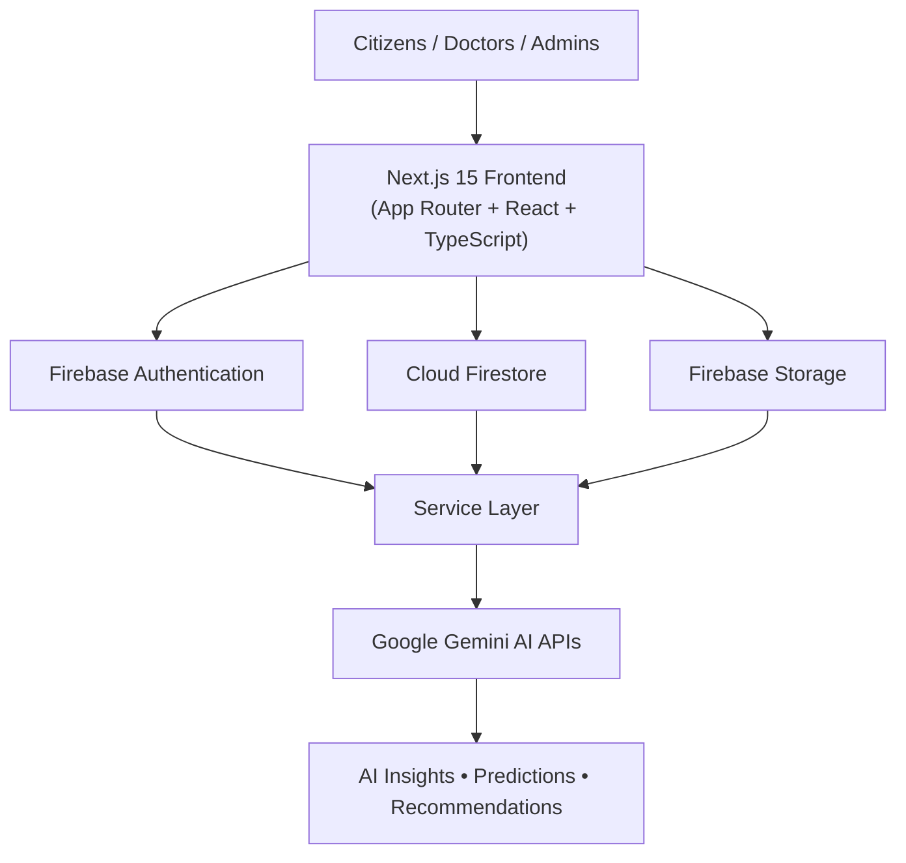
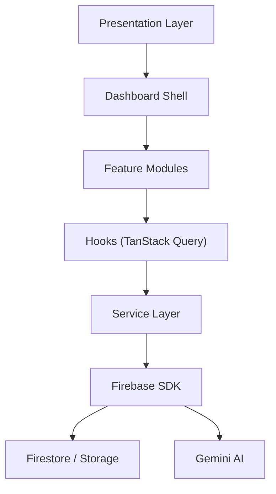
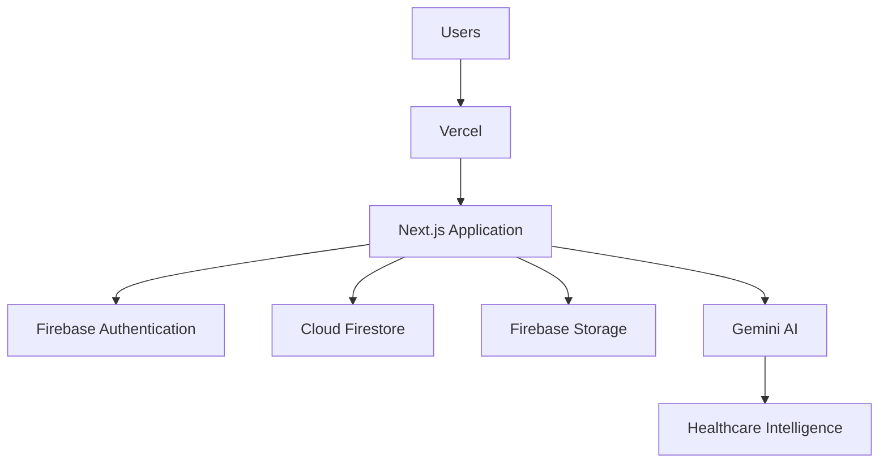

# 🏥 ArogyaOS

### AI-Powered Unified Healthcare Operating System

[](https://nextjs.org/)
[](https://react.dev/)
[](https://www.typescriptlang.org/)
[](https://firebase.google.com/)
[](https://ai.google.dev/)
[](https://tailwindcss.com/)
[](./LICENSE)

**A production-ready AI-powered healthcare platform that unifies Citizens, Hospitals, PHCs, CHCs, Doctors, Pharmacies, Laboratories, and District Administrators into one intelligent ecosystem.**

[Live Demo](https://arogyaos-five.vercel.app) · [Report Bug](https://github.com/princemittalr/arogyaos/issues) · [Request Feature](https://github.com/princemittalr/arogyaos/issues)

---

## 🚀 Built for the Google AI Hackathon

ArogyaOS enables hospitals, pharmacies, laboratories, doctors, citizens, PHCs, CHCs, and district administrators to collaborate through one intelligent platform. Instead of simply storing healthcare data, ArogyaOS transforms operational data into actionable intelligence using **Google Gemini AI**, helping healthcare systems predict shortages, optimize resources, and improve patient care.

---

## 🌍 Overview

Healthcare systems often rely on disconnected software, spreadsheets, and manual reporting. This results in delayed decisions, medicine shortages, overloaded hospitals, and inefficient resource allocation.

**ArogyaOS** addresses these challenges by combining modern web technologies with Artificial Intelligence to create a unified digital healthcare ecosystem across:

- 🏥 Hospital Management
- 👨‍⚕️ Doctor Workspaces
- 👤 Citizen Healthcare Portal
- 💊 Pharmacy & Inventory Management
- 🧪 Laboratory Operations
- 🏛️ District AI Command Center
- 🤖 Google Gemini AI Intelligence
- 📊 Real-time Analytics & Monitoring

---

## 📖 Problem Statement

Healthcare institutions continue to face operational challenges that directly impact patient care and resource management:

- 💊 Medicine stock-outs due to lack of predictive monitoring
- 🏥 Bed shortages during emergencies
- 👨‍⚕️ Unpredictable doctor availability
- 📈 Sudden patient surges without planning
- 📊 Manual reporting and fragmented data
- 🔄 Poor coordination between PHCs, CHCs, Hospitals, and District Authorities
- 🚨 Lack of real-time operational intelligence

Traditional Hospital Management Systems mainly **record information**. They rarely **predict future problems**, **recommend actions**, or **assist administrators in making operational decisions**.

## 💡 Our Solution

ArogyaOS transforms healthcare management from a traditional Hospital Management System into an **AI-powered Healthcare Operating System**, using **Google Gemini AI** to generate proactive recommendations:

- 📈 Predicting medicine shortages
- 👥 Forecasting patient footfall
- 🛏️ Monitoring bed occupancy
- 👨‍⚕️ Tracking doctor availability
- 🔄 Recommending resource redistribution
- 📊 Generating executive district summaries
- 📝 Assisting doctors with consultation summaries

---

## 🚀 Why ArogyaOS?

| Traditional Hospital Management System | ArogyaOS |
|---|---|
| Stores Data | Understands Data |
| Manual Reporting | AI-generated Insights |
| Reactive Operations | Predictive Intelligence |
| Fragmented Systems | Unified Healthcare Platform |
| Static Dashboards | Live AI Command Center |
| Manual Planning | AI Recommendations |
| Limited Visibility | District-wide Intelligence |
| Basic Reports | Executive Decision Support |
| Single Organization | Entire Healthcare Ecosystem |
| No Forecasting | AI Predictions |

---

## 👥 Supported User Roles

| Role | Primary Responsibilities |
|---|---|
| 👤 Citizen | Appointments, reports, prescriptions, healthcare services |
| 👨‍⚕️ Doctor | Consultations, prescriptions, follow-ups, AI assistance |
| 🏥 Hospital Administrator | Operations, staff, inventory, analytics |
| 💊 Pharmacist | Medicine inventory, dispensing, expiry monitoring |
| 🧪 Laboratory Staff | Test management, reports, diagnostics |
| 🏛️ District Administrator | District monitoring, AI insights, resource management |

> **Note:** The current codebase implements the roles above (Citizen, Doctor, Hospital Administrator, Pharmacist, Laboratory Staff, and District Administrator). Additional granular roles such as ASHA Worker, Nurse, State Health Officer, and Super Administrator are part of the platform's future roadmap and are not yet present as distinct modules in this repository.

---

## ✨ Core Features

### 🏛️ District AI Command Center
The flagship module — built for District Health Officers to monitor healthcare infrastructure across an entire district in real time.

- Executive Dashboard
- Hospital / PHC / CHC Monitoring
- Medicine Stock Monitoring
- Bed Occupancy Dashboard
- Doctor Attendance Analytics
- Critical Alerts
- District Performance Metrics
- AI Resource Redistribution
- Executive Reports
- AI Operations Center

### 🏥 Hospital Administration
- Hospital Dashboard
- Department Management
- Doctor & Staff Management
- Patient Registry
- Appointment Management
- Inventory Management
- Room & Bed Management
- Reports & Analytics
- Pharmacy & Laboratory Integration
- AI Hospital Health Score

### 👨‍⚕️ Doctor Workspace
- Today's Schedule
- Patient Queue & History
- Consultation Workspace
- Digital Prescription Builder
- Lab Test Orders
- Follow-up Management
- Calendar
- AI Consultation Summary

### 👤 Citizen Portal
- Hospital Search
- Doctor Search
- Appointment Booking & History
- Medical Timeline
- Digital Prescriptions
- Lab Reports
- Family Profiles
- Notifications
- Personal Health Profile

### 💊 Pharmacy Management
- Medicine Inventory
- Stock Monitoring & Low Stock Alerts
- Expiry Monitoring
- Dispensing Desk
- Stock Reports
- AI Stock Forecast

### 🧪 Laboratory Management
- Test Catalogue
- Sample Tracking
- Report Generation
- Home Collection
- Diagnostics Dashboard
- Performance Analytics

---

## 🤖 Google Gemini AI Features

Artificial Intelligence powers the decision-making layer across ArogyaOS.

| Capability | Description |
|---|---|
| 🧠 Medicine Stock Forecasting | Risk score, confidence level, remaining days, suggested reorder quantity, AI recommendation |
| 📈 Patient Footfall Prediction | Tomorrow's OPD/IPD, weekly trends, peak hours, waiting time |
| 🏥 Hospital Health Score | Composite score from bed occupancy, medicine availability, doctor attendance, appointment load, critical alerts, resource utilization |
| 🔄 Resource Redistribution | AI-recommended transfers of medicines, beds, staff, and emergency resources between facilities |
| 📝 AI Consultation Summary | Clinical summary, diagnosis, symptoms, prescription draft, follow-up advice |
| 📊 District Executive Intelligence | District summary, critical issues, facility rankings, emerging trends, AI recommendations |
| 💬 AI Operations Chat | Natural-language querying of operational data (e.g. *"Which hospitals are running low on insulin?"*) |

If the Gemini API is unavailable, ArogyaOS automatically falls back to **intelligent mock responses** for demonstration purposes.

---

## 🏗️ System Architecture



## 🧩 High-Level Application Flow



## ☁️ Cloud Infrastructure



---

## 📂 Project Structure

    src
    │
    ├── app/
    │   ├── dashboard/
    │   ├── api/
    │   ├── login/
    │   ├── register/
    │   └── ...
    │
    ├── components/
    │   ├── layout/
    │   ├── ui/
    │   ├── ai/
    │   ├── charts/
    │   └── forms/
    │
    ├── features/
    │   ├── auth/
    │   ├── citizen/
    │   ├── doctor/
    │   ├── hospital/
    │   ├── pharmacy/
    │   ├── laboratory/
    │   ├── district/
    │   ├── ai/
    │   └── shared/
    │
    ├── firebase/
    ├── providers/
    ├── config/
    ├── hooks/
    ├── services/
    ├── types/
    ├── utils/
    └── design-system/

Other notable repository contents: `.github/` (CI workflows), `.vscode/`, `docs/`, `e2e/` (Playwright end-to-end tests), `public/` (static assets and screenshots), `firebase.json`, `firestore.rules`, `firestore.indexes.json`, `storage.rules`, `eslint.config.mjs`, `playwright.config.ts`, `vitest.config.ts`, `tsconfig.json`.

---

## ⚙️ Technology Stack

| Layer | Technology |
|---|---|
| Frontend | Next.js 15 (App Router) |
| Language | TypeScript |
| Styling | Tailwind CSS |
| UI Components | shadcn/ui |
| Animations | Framer Motion |
| Icons | Lucide React |
| Charts | Recharts |
| Forms | React Hook Form |
| Validation | Zod |
| State/Data | TanStack Query |
| Authentication | Firebase Authentication |
| Database | Cloud Firestore |
| Storage | Firebase Storage |
| AI Engine | Google Gemini 2.5 Flash |
| E2E Testing | Playwright |
| Unit Testing | Vitest |
| Linting | ESLint |
| Deployment | Vercel + Firebase |

---

## 🔐 Security

**Authentication**
- Firebase Authentication (Email & Password, Google Sign-In)
- Session persistence

**Authorization**
- Role-Based Access Control (RBAC)
- Protected routes via Edge Middleware
- Server-side validation

**Data Protection**
- Firestore Security Rules (`firestore.rules`)
- Storage Security Rules (`storage.rules`)
- Environment variable isolation
- Server-only Gemini API key usage
- Zod request validation

---

## ⚡ Performance Optimizations

**Frontend**
- Next.js App Router & React Server Components
- Route-based code splitting, dynamic imports, lazy loading
- Optimized fonts and image optimization

**Data Layer**
- TanStack Query caching, request deduplication, background refetching, optimistic updates

**User Experience**
- Skeleton loaders, smooth transitions, error boundaries, toast notifications, empty states

---

## 🎨 Design Principles

- Enterprise-first UI
- AI-first workflows
- Accessibility focused
- Mobile responsive
- Feature-driven, modular architecture
- Reusable services
- Type-safe development end-to-end
- Cloud-native deployment

---

## 📈 Scalability

Designed to scale without architectural changes across:

Single Clinic → Single Hospital → Multi-Hospital Network → District Healthcare System → State-wide Healthcare Network → National Healthcare Infrastructure

---

## 🚀 Getting Started

### 📋 Prerequisites

- Node.js **20+**
- npm or pnpm
- Git
- A Firebase Project
- Google Gemini API Key *(optional — falls back to mock responses if absent)*

```bash
node -v
npm -v
```

### 📥 Clone & Install

```bash
git clone https://github.com/princemittalr/arogyaos.git
cd arogyaos
npm install
```

### 🔑 Environment Variables

Create a `.env.local` file:

```bash
# ==============================
# Firebase Client Configuration
# ==============================
NEXT_PUBLIC_FIREBASE_API_KEY=
NEXT_PUBLIC_FIREBASE_AUTH_DOMAIN=
NEXT_PUBLIC_FIREBASE_PROJECT_ID=
NEXT_PUBLIC_FIREBASE_STORAGE_BUCKET=
NEXT_PUBLIC_FIREBASE_MESSAGING_SENDER_ID=
NEXT_PUBLIC_FIREBASE_APP_ID=

# ==============================
# Firebase Admin SDK
# ==============================
FIREBASE_PROJECT_ID=
FIREBASE_CLIENT_EMAIL=
FIREBASE_PRIVATE_KEY=

# ==============================
# Google Gemini
# ==============================
GEMINI_API_KEY=
```

> ⚠️ Never commit `.env.local` or any private keys to GitHub.

### 🔥 Firebase Setup

1. **Authentication** — enable Email & Password and Google Sign-In providers.
2. **Firestore Database** — create in Production Mode; apply `firestore.rules` and `firestore.indexes.json`.
3. **Firebase Storage** — enable Cloud Storage; apply `storage.rules`.

### 🤖 Gemini Setup

Create an API key from **Google AI Studio** and set `GEMINI_API_KEY`. If unavailable, ArogyaOS automatically switches to intelligent mock responses for demonstration purposes.

### ▶️ Run Locally

```bash
npm run dev
```

Open `http://localhost:3000`.

### 🏗️ Production Build

```bash
npm run build
npm start
```

### 🧪 Quality Checks

```bash
npm run lint
npx tsc --noEmit
```

---

## 📦 Available Scripts

| Command | Description |
|---|---|
| `npm run dev` | Start development server |
| `npm run build` | Create production build |
| `npm start` | Start production server |
| `npm run lint` | Run ESLint |
| `npx tsc --noEmit` | Type checking |

---

## 🧪 Testing

| Layer | Tooling |
|---|---|
| Unit / Component | Vitest (`vitest.config.ts`) |
| End-to-End | Playwright (`playwright.config.ts`, `e2e/`) |
| Static Analysis | ESLint (`eslint.config.mjs`), TypeScript compiler |

---

## 🔁 CI/CD

Continuous integration workflows are configured under `.github/` and run automated checks (lint, type-check, and tests) on pushes and pull requests. Deployment is handled via **Vercel** for the frontend, with **Firebase** providing backend services (Authentication, Firestore, Storage) — no separate backend deployment is required.

```bash
vercel
# or
vercel --prod
```

**Production Checklist**
- ✅ All environment variables configured
- ✅ Firebase Authentication enabled
- ✅ Firestore Security Rules configured
- ✅ Storage Rules configured
- ✅ Gemini API Key configured (optional)
- ✅ Production build passes
- ✅ ESLint passes
- ✅ TypeScript passes

---

## 🧪 Demo Accounts

| Role | Email | Password |
|---|---|---|
| 👤 Citizen | citizen@arogyaos.demo | Demo@123 |
| 👨‍⚕️ Doctor | doctor@arogyaos.demo | Demo@123 |
| 🏥 Hospital Admin | hospital@arogyaos.demo | Demo@123 |
| 💊 Pharmacist | pharmacy@arogyaos.demo | Demo@123 |
| 🏛️ District Admin | district@arogyaos.demo | Demo@123 |

> Replace demo credentials with your own seeded accounts before production use. If the Gemini API key is not configured, AI features in these demo accounts operate using intelligent mock responses rather than live model output.

---

## 🛠️ Troubleshooting

**Firebase Authentication Issues** — verify Firebase configuration; enable Email/Password and Google Sign-In; check environment variables.

**Firestore Permission Errors** — verify Firestore Security Rules; ensure the authenticated user has the required role.

**Gemini API Errors** — verify `GEMINI_API_KEY`; confirm the API is enabled; the app automatically falls back to intelligent mock responses if unavailable.

---

## 📱 Browser Support

Google Chrome · Microsoft Edge · Mozilla Firefox · Safari (latest versions recommended)

---

## 📸 Application Preview

> Screenshots below are placeholders — replace with actual application captures.

| Landing Page | District AI Command Center |
|---|---|
| `public/screenshots/landing.png` | `public/screenshots/district-dashboard.png` |

| Hospital Administration | Doctor Workspace |
|---|---|
| `public/screenshots/hospital-dashboard.png` | `public/screenshots/doctor-dashboard.png` |

| Citizen Portal | Pharmacy Dashboard |
|---|---|
| `public/screenshots/citizen-dashboard.png` | `public/screenshots/pharmacy-dashboard.png` |

| AI Assistant | |
|---|---|
| `public/screenshots/ai-chat.png` | |

---

## 🎥 Live Demo

| Resource | Link |
|---|---|
| 🌐 Live Application | [arogyaos-five.vercel.app](https://arogyaos-five.vercel.app) |
| 🎬 Demo Video | Coming Soon |
| 📑 Presentation Deck | Coming Soon |

---

## 📅 Future Roadmap

**Phase 1** — ✅ Foundation · ✅ Authentication · ✅ Dashboard Framework

**Phase 2** — ✅ Citizen Portal · ✅ Hospital Administration · ✅ Doctor Workspace · ✅ Pharmacy Module · ⏳ Laboratory Module

**Phase 3** — ✅ District AI Command Center · ✅ Google Gemini AI · ✅ AI Chat · ✅ Resource Redistribution · ✅ Hospital Health Score

**Future Enhancements**
- 🚑 Ambulance Tracking
- 🩸 Blood Bank Management
- 📶 Offline Mode
- 📍 GIS Mapping
- 📡 IoT Device Integration
- 🆔 ABHA Integration
- 🏥 Telemedicine
- 📈 Disease Outbreak Prediction
- 🌐 Multi-District Deployment

---

## 🤝 Contributing

Contributions are welcome! See [`CONTRIBUTING.md`](./CONTRIBUTING.md) and [`CODE_OF_CONDUCT.md`](./CODE_OF_CONDUCT.md) for guidelines.

```bash
# 1. Fork the repository
# 2. Create a feature branch
git checkout -b feature/your-feature

# 3. Commit your changes
git commit -m "feat: add your feature"

# 4. Push to GitHub
git push origin feature/your-feature

# 5. Open a Pull Request
```

## 🔒 Security Policy

See [`SECURITY.md`](./SECURITY.md) for reporting vulnerabilities.

## 📄 License

Licensed under the **MIT License**. See [`LICENSE`](./LICENSE) for details.

## 🙏 Acknowledgements

Built using Google AI, Google Gemini, Firebase, Next.js, React, Tailwind CSS, shadcn/ui, Framer Motion, Recharts, React Hook Form, Zod, TanStack Query, and Lucide React.

## 📬 Contact

**Developer:** Prince Mittal
GitHub: [github.com/princemittalr](https://github.com/princemittalr)
Repository: [github.com/princemittalr/arogyaos](https://github.com/princemittalr/arogyaos)

---

<div align="center">

⭐ If you found ArogyaOS helpful, please consider giving this repository a **Star**!

**Built with ❤️ to empower healthcare through Artificial Intelligence.**

*Google AI Hackathon Project*

</div>
