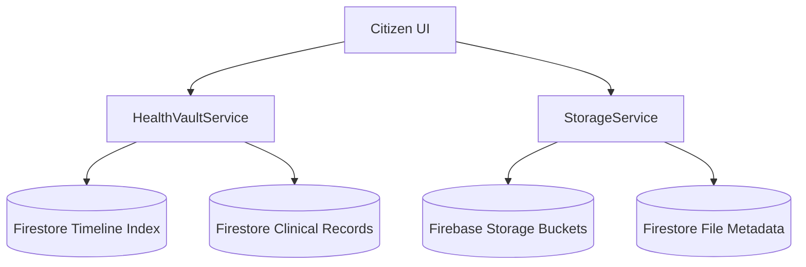

# Health Vault — Technical Documentation & Guidelines

ArogyaOS Health Vault is an enterprise-grade, highly observable, offline-resilient, and secure personal health record and clinical document storage platform. 

---

## 1. System Architecture

The module utilizes a **Hybrid Index-Pointer Pattern** to decouple dense clinical data storage from search indexing and timeline rendering.



---

## 2. Folder Structure

```
src/features/health-vault/
├── components/          # React components (Offline Banner, Detail Drawer, Upload Modal)
├── core/                # Core domain: constants, events, typed error classes
├── hooks/               # React custom hooks (observability, offline, timeline query)
├── repositories/        # Firestore persistence layer (Base, Storage, Timeline)
├── services/            # Service orchestrators (Ingestion, Version, Preview, Caching)
├── types/               # Strong TypeScript schemas (FHIR resources, storage)
├── utils/               # Helpers: validations, retry policies, ULID generator
└── README.md            # Module Developer Documentation
```

---

## 3. Core Services

### Ingestion & Query (`HealthVaultService`)
- Validates payload structures via Zod before persisting records to database.
- Calculates SHA-256 hashes server-side to guarantee content integrity.
- Encapsulates database transactions for atomic dual-writes: updates the specific clinical record collection and writes to the timeline index.

### Secure File Storage (`StorageService`)
- **UploadService**: Directs chunked and resumable file uploads to structured paths (`health-vault/buckets/{ownerId}/{year}/{month}/{fileId}`). Includes stubs for antivirus gateways.
- **DownloadService**: Stream-checks ownership and roles before generating time-bounded private access URLs.
- **PreviewService**: Generates secure proxied preview routes for inline media rendering (PDFs, images, texts) without exposing raw bucket locations.
- **VersionService**: Manages historical versioning chain by shifting old metadata pointers to a nested sub-collection under `versions` before overwriting the main document.

---

## 4. Performance & Caching

An in-memory **Least-Recently Used (LRU) Caching Layer** (`VaultCache`) decreases Firestore reads and cuts latency.

- `timelineCache`: Stores paginated timeline pages for 60 seconds (max 200).
- `recordDetailCache`: Caches full clinical documents for 30 seconds (max 100).
- `fileMetaCache`: Caches storage metadata records for 120 seconds (max 100).
- **Invalidation Strategy**: Any mutating action (write, edit, archive, restore) triggers immediate invalidation of the corresponding cache entries.

---

## 5. Resilience & Offline Support

### Retry Logic (`withRetry`)
- Protects the system against transient connection errors.
- Executes exponential backoff with randomized jitter to prevent server congestion.
- Instantly propagates non-retryable errors (e.g., Validation, Permission Denied) without redundant retries.

### Offline Sync Queue (`VaultOfflineQueue`)
- Backs up operations to `localStorage` to survive session losses or browser closures.
- Operates a **Last-Write-Wins (LWW)** strategy using ISO timestamps to resolve merge conflicts with the cloud database.
- Monitors network online transitions to automate background queues processing.

---

## 6. Event-Driven Telemetry

### Strongly-Typed Event Bus (`HealthVaultEventBus`)
- Integrates 14 domain events notifying consumer modules of changes.
- Implements listener isolation, ensuring that exceptions in one subscriber do not affect other listeners or block primary workflows.

### Audit Logging (`AuditLogger`)
- Writes immutable, append-only records to Firestore.
- Strict **No-PHI** policy: logs track event types, UIDs, and timestamps, but never patients' names, diagnoses, or clinical details.
- Fail-safe design: logging failures are captured gracefully and never interrupt user actions.

---

## 7. Security Enforcement

- **Ownership Checks**: Every mutation compares the target record's `ownerId` against the user's validated context.
- **Role Permissions**: Evaluates role boundaries (`citizen`, `doctor`, `hospital_admin`, `super_admin`) for file access.
- **No IP Storage**: IP tracking is decoupled from clinical database documents and restricted strictly to security perimeter logging.
